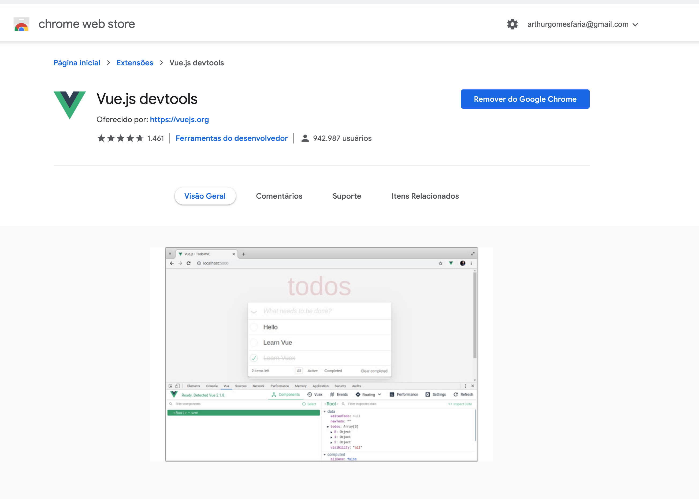
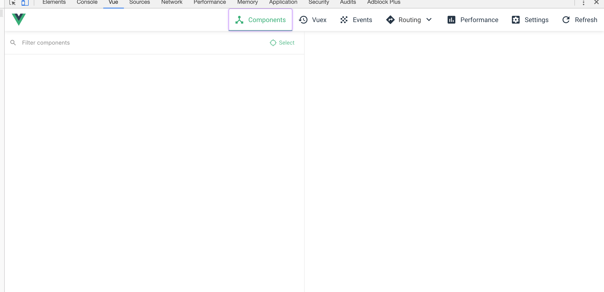
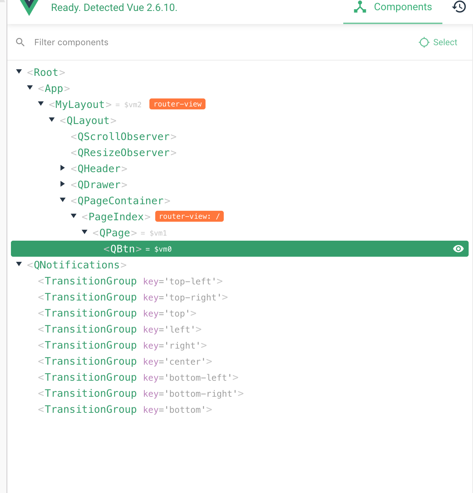
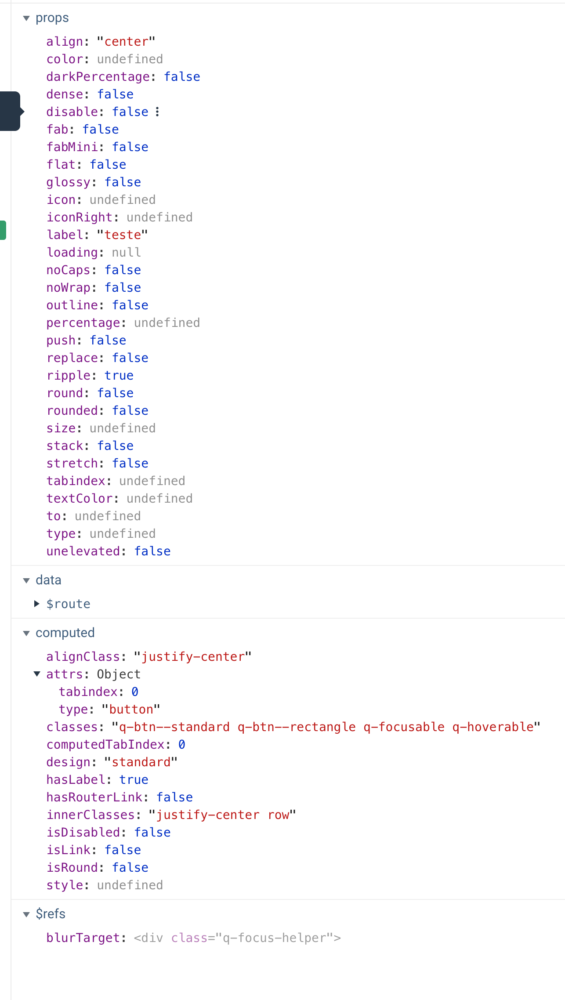

## Vue Dev Tools

Tudo bem, entendi como utilizar o debugger do VSCode, mas se eu só quiser verificar o estado da aplicação, sem gerar uma parada na execução?

Bom, para isso tem uma extensão muito interessante para o chrome chamada VueDevTools:

E o link para instalação é: https://chrome.google.com/webstore/detail/vuejs-devtools/nhdogjmejiglipccpnnnanhbledajbpd?hl=pt-BR.

Com ela é possível verificar todo o estado da aplicação e todas as variáveis envolvidas, assim como a árvore de componentes:

Por exemplo, acima temos uma árvore de componentes tendo como raiz um `App` que vai até uma Página com somente um botão, no caso, um `QBtn`, que ao selecioná-lo, podemos ver todas suas propriedades:

Desta forma, conseguimos visualizar qual o estado atual da aplicação e analisar se tudo está funcionando como o esperado!

Note que esta ferramenta só funciona em sites que tem a versão de Debug do VueJS. Após a compliação, a ferramenta não conseguirá analisar profundamente o estado da aplicação.