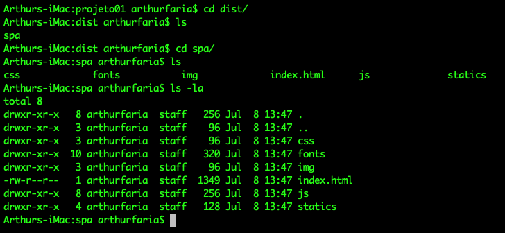

## Quasar Deploy

Imagine se para fazer a build de sua aplicação você só precisasse de apenas um comando. Não seria um mundo melhor?

Felizmente, o quasar nos permite fazer a build completa da aplicação com apenas o comando `quasar build`.

Podemos especificar o modo através do parâmetro `-m` da forma:

```sh
# Gera um resultado SPA
quasar build -m spa
# Gera um resultado PWA
quasar build -m pwa
# Gera um resultado electron
quasar build -m electron
# Gera um resultado mobile
quasar build -m cordova
```

Assim, é possível distribuir nossa aplicação nas mais variadas plataformas e das mais variadas formas!

O resultado é sempre colocado na pasta `dist`, na raiz do projeto.



Se clicarmos apenas em index.html, não conseguiremos rodar a aplicação em plenitude, já que há uma série de dependências que devem ser servidas através um servidor HTTP.

Podemos então na pasta `dist` rodar o comando:

```shell
$ docker run --rm --name some-nginx -v $PWD/spa:/usr/share/nginx/html:ro -p 8081:80 -d nginx
```

Agora, podemos automatizar toda a build da nossa imagem com o Docker, da forma (criando um arquivo `dockerfile` na raiz da aplicação e executando o comando abaixo):

```dockerfile
FROM node:10-alpine AS build

WORKDIR /app

COPY package*.json ./
RUN npm install

COPY . .
RUN npm install -g @quasar/cli yarn
RUN quasar build

FROM nginx
WORKDIR /usr/share/nginx/html
COPY --from=build /app/dist/spa .

```

Agora, é só fazer a build da imagem com `docker build -t testeApp -f dockerfile .`

E podemos executar o comando `docker run --rm -p 8081:80 teste` e testarmos a aplicação entrando na URL http://localhost:8081 

