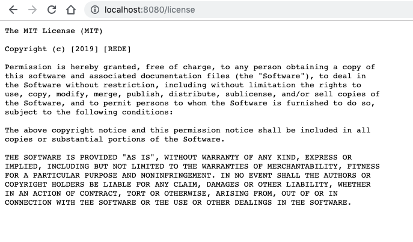

# Servindo arquivos estáticos

Embora estamos criando um serviço REST, pode ser o caso de ser necessário servir arquivos estáticos, sejam eles imagens, PDFs ou até mesmo arquivos de estilo .css ou .html. A princípio, é possível fazer isso através da especificação de rotas para cada um dos arquivos e então escrever uma função que lê cada um e retorna para o usuário. No entanto, o Express fornece uma solução menos, digamos, arcaica.


### Implementando

Vamos supor que queremos expor as imagens do baralho de Delegation Poker, disponível na pasta `assets` pelo nome de `delegation.zip`.

Vamos criar então na pasta `src` uma nova pasta para receber os arquivos, chamada `baralhos`. Dentro dela, vamos criar outra chamada `delegation`, onde as cartas devem ser colocadas.

Agora, vamos só adicionar a "rota"  `/static` que aponta para a pasta de baralhos:

```js
const express = require("express");
const path = require("path");
const app = express();

app.get("/", (req, res) => res.send("Server alive, with Express!"));

app.use(
    "/static",
    express.static(path.join(__dirname, "./baralhos"), {
        immutable: true,
        maxAge: "30 days"
    })
);

app.use((err, req, res, next) => {
    console.error("Error....", err.message);
    res.status(500).send("INTERNAL SERVER ERROR");
});

app.listen(8080, () =>
    console.log(
        "Mini Express static server ready at http://localhost:8080/!"
    )
);
```

O famoso `app.use()` neste caso recebe uma função especial, a `express.static()`, que facilita nosso trabalho ao ler, codificar e enviar para o cliente o arquivo estático. Além disso, ainda adiciona headers de validade para o cache! Vamos ver mais de "perto":


- O primeiro parâmetro do `app.use()` se refere ao caminho base a ser acessado. Note que não temos uma pasta chamada `static` no código fonte, portanto, é apenas um caminho virtual para permitir acesso aos arquivos da pasta `baralhos`. 
- O primeiro parâmetro da função `express.static()` especifica o verdadeiro caminho dos arquivos. 
- The second parameter to express.static() lets you add options; in our case, I'm sending some caching headers so that browsers will know that the file can be safely cached for 30 days.

The format for the maxAge parameter can be in a format understood by the ms package (https://github.com/zeit/ms), which is able to convert date and time strings into the equivalent milliseconds, which is standard for JS.


### Testando

Se tudo foi implementado corretamente, ao executar o comando `node src/index.js` na raiz do seu projeto, é possível acessar no navegador o link:

http://localhost:8080/static/delegation/dp1.png


E ver algo parecido com:


### Arquivos estáticos por rota

Caso você não queira servir uma série de arquivos através de uma rota, também é possível serví-los separadamente, especificando cada um. Vamos supor então que sua API precisa de uma licença, e ela é acessada através do link `/license`. Desta forma, podemos servir o arquivo `licença.txt` (disponível na pasta assets do repositório) através do código:

```js
app.get("/license", (req, res) =>
    res.sendFile(path.join(__dirname, './license.txt'))
);
```



> Caso você queira saber mais sobre como servir arquivos estáticos, acesse a documentação em https://expressjs.com/en/starter/static-files.html