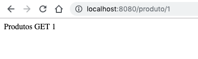

# Adicionando Rotas

O roteamento em servidores de requisições é extremamente importante. E como já visto anteriormente, o Express tem um jeito mais fácil de fazer tudo, incluindo a adição de rotas.

Por exemplo, como no pacote `json-server` utilizado anteriormente, tivemos as rotas expostas com:

- `/produto` (GET para obter todos os produtos, e POST para criar um novo produto)

- `/produto/id` (GET para obter o produto, PUT para atualizar, e DELETE para excluir)

  

E agora vamos implementar essas rotas na nossa aplicação.

### Implementando

Quem diria que a última frase da seção anterior viraria um título! Bom, vamos ao que interessa. Com o Express, você não precisa escrever muito código para implementar o roteamento.

```js
// Source file: src/index.js

/* @flow */

const express = require("express");
const app = express();

const myRouter = require("./router_home.js");
app.use("/", myRouter);

// eslint-disable-next-line no-unused-vars
app.use((err, req, res, next) => {
    console.error("Error....", err.message);
    res.status(500).send("INTERNAL SERVER ERROR");
});

app.listen(8080, () =>
    console.log("Routing ready at http://localhost:8080")
);
```

O arquivo `router_home.js` servirá como o primeiro nível, implementando o resto das rotas definidos em outros arquivos:

```js
// Source file: src/router_home.js

/* @flow */

const express = require("express");
const routerHome = express.Router();

const routerProdutos = require("./router_produtos.js");

routerHome.use("/produto", routerProdutos);

module.exports = routerHome;
```

Agora vamos definir as rotas para nossa API de produtos:

```js
// Source file: src/router_produtos.js

/* @flow */

const express = require("express");
const routerProdutos = express.Router();

routerProdutos.get("/", (req, res) => {
    res.send(`Produtos GET ALL... `);
});

routerProdutos.get("/:id", (req, res) => {
    res.send(`Produtos GET ${req.params.id}`);
});

routerProdutos.delete("/:id", (req, res) => {
    res.send(`Produtos DELETE... ${req.params.id}`);
});

routerProdutos.post("/", (req, res) => {
    res.send(`Produtos POST... `);
});

routerProdutos.put("/:id", (req, res) => {
    res.send(`Produtos PUT... ${req.params.id}`);
});

module.exports = routerProdutos;
```

Executando então a aplicação e acessando o endpoint, temos:



