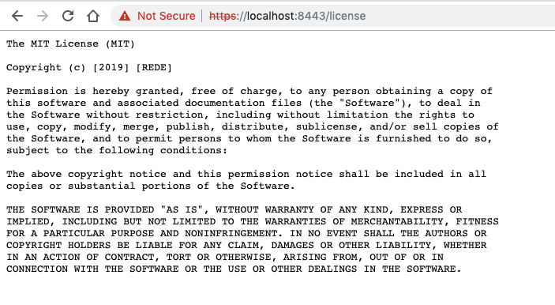

# Implementando conexões seguras

Enviar e receber dados utilizando conexões criptografadas nos dias de hoje é extremamente necessário, principalmente se informações sensíveis são trocadas. Então, vamos ver como habilitar o HTTPS no nosso pequeno servidor.


### Implementando

Vamos começar a implementar o HTTP, mas primeiro temos que preparar algumas coisas.

O primeiro passo é arrumar um certificado que valida que o domínio é realmente seu. Como não queremos gastar dinheiro comprando um certificado para `localhost`, vamos criar o nosso próprio! Embora não sejam confiáveis, servirão de exemplo para um certificado válido.

Se você estiver utilizando Linux/MacOS, você pode executar os comandos (se não conseguir, os três arquivos estarão na pasta assets/certificados.  -   \o/   ):

```sh
openssl req -newkey rsa:4096 -nodes -keyout localhost.key -out localhost.csr
openssl x509 -signkey localhost.key -in localhost.csr -req -days 366 -out localhost.crt
```

Ao executar os comandos acima (ou baixar os arquivos no repositório) você terá o seguinte:

```
Arthurs-iMac:certificados arthurfaria$ ls
	localhost.crt	localhost.csr	localhost.key
```

Os três arquivos compreendem:

- localhost.csr - Certificate Signing Request
  - é um bloco de texto encriptado que é gerado no servidor onde o certificado será utilizado. 
- localhost.key - Chave privada
- localhost.crt - O certificado auto assinado


Aogra, precisamos adicionar os certificados ao nosso servidor. É recomendado que em produção, estes arquivos estejam armazenados de forma segura e com permissões de somente leitura. Usaremos o módulo `fs` para ler os certificados e passá-los para o nosso servidor:

```js
/* @flow */

const express = require("express");
const app = express();
const https = require("https");

const fs = require("fs");
const path = require("path");

const keysPath = path.join(__dirname, "./certificados");

const ca = fs.readFileSync(`${keysPath}/localhost.csr`);
const cert = fs.readFileSync(`${keysPath}/localhost.crt`);
const key = fs.readFileSync(`${keysPath}/localhost.key`);

https.createServer({ ca, cert, key }, app).listen(8443);
```

E se novamente executarmos o servidor, teremos:



Como o certificado é auto assinado, o Chrome não mostrará o famoso cadeado verde!