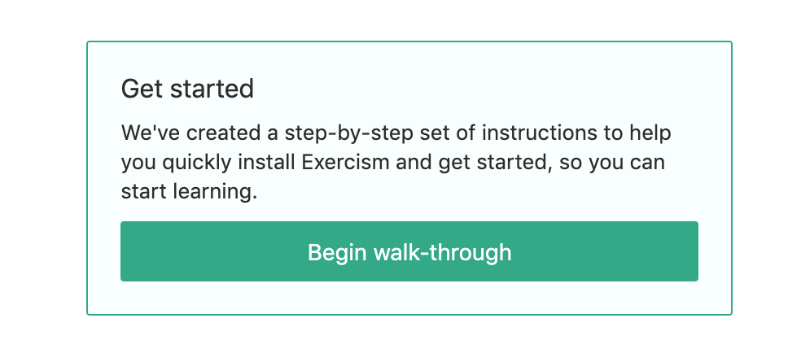
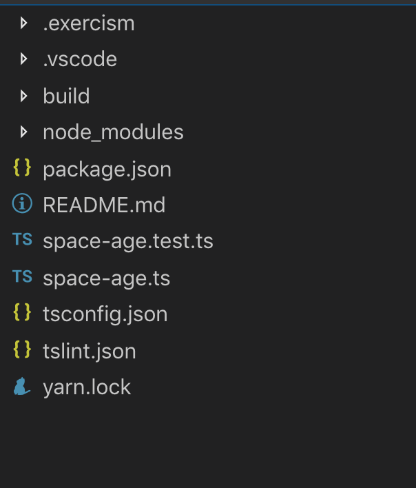
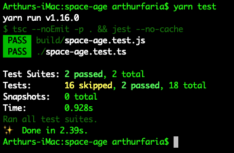

# Exercícios

Para esta parte do treinamento, utilizaremos uma plataforma externa de exercícios, chamada "Exercism". Ela possui exercícios em cerca de 48 linguagens diferentes de programação, de C++ a TypeScript. Como sugestões anteriores de plataforma de exercícios foram requisitadas, vamos experimentar esta.


Primeiro, é necessário fazer uma conta, além de ser possível autenticar com o GitHub. Desta forma, todas as linguagens serão mostradas. Como é uma plataforma gratuita, podemos utilizar da forma que desejarmos.


### Começando

Vamos então entrar na "Track" de TypeScript, disponível no link: https://exercism.io/my/tracks/typescript e escolher um exerício para executar. 

Vamos primeiro, escolher um fácil:


Logo no canto direito, é possível ver um passo a passo de como instalar as dependências e configurar o CLI do Exercism no seu computador:



Desta forma, você instalará a CLI e também irá configurar para que seu token seja registrado. Agora, é só baixar o exercício, através do comando:

`exercism download --exercise=space-age --track=typescript` 


Na raiz da solução, temos os arquivos:



Com todos os pacotes previamente configurados. Para instalar as dependências, basta executar o comando `yarn install` e para testar seu código, `yarn test`.

Os exercícios devem ser resolvidos para que passem nos testes, e assim é possível submetê-los. Ao enviar, é possível verificar soluções alternativas e também entrar na discussão sobre os problemas na plataforma!

Vamos então, resolver este primeiro exercício, do `SpaceAge`.


### Analisando Space Age

Primeiro, vamos verificar o arquivo `space-age.test.ts`, responsável pelo código de teste que deve ser executado.

```tsx
import SpaceAge from './space-age'

describe('Space Age', () => {

  it('age in seconds', () => {
    const age = new SpaceAge(1000000)
    expect(age.seconds).toEqual(1000000)
  })

  xit('age in earth years', () => {
    const age = new SpaceAge(1000000000)
    expect(age.onEarth()).toEqual(31.69)
  })
```

Temos então que o código que devemos desenvolver, pode abrigar uma Classe `SpaceAge` que tem um construtor recebendo um `number` que indica os segundos e métodos que fazem a conversão sempre que necessário.

Portanto, temos que escrever uma classe que contenha propriedades e métodos para passar nos testes acima. Um exemplo de solução é:

`space-age.ts`

```js
export default class SpaceAge {
  private readonly _seconds: number;
  constructor(second: number) {
    this._seconds = second;
  }
  get seconds() {
    return this._seconds;
  }
  onEarth(): number {
    return Math.round((this._seconds / 31557600) * 100) / 100;
  }
  onMercury(): number {
    return Math.round((this.onEarth() / 0.2408467) * 100) / 100;
  }
  onVenus(): number {
    return Math.floor((this.onEarth() / 0.61519726) * 100) / 100;
  }
  onMars(): number {
    return Math.round((this.onEarth() / 1.8808158) * 100) / 100;
  }
  onJupiter(): number {
    return Math.round((this.onEarth() / 11.862615) * 100) / 100;
  }
  onSaturn(): number {
    return Math.round((this.onEarth() / 29.447498) * 100) / 100;
  }
  onUranus(): number {
    return Math.round((this.onEarth() / 84.016846) * 100) / 100;
  }
  onNeptune(): number {
    return Math.round((this.onEarth() / 164.79132) * 100) / 100;
  }
}
```

Assim, se executarmos o comando `yarn test` ou `npm run test`, temos o resultado:



E agora, podemos submeter para a plataforma com o comando;

```SH
exercism submit space-age.ts
```

E o retorno deve ser uma URL, que ao acessá-la, teremos acesso a outras soluções da comunidade assim como discussões sobre o problema!


## Agora de verdade

Um bom programador precisa saber escolher os problemas que enfrenta. Se escolhe problemas muito acima de sua capacidade, datas limites são estouradas e o stress reina. Se escolhe problemas muito fáceis, é possível que perca o gosto. Portanto, vou deixar a escolha dos problemas "livre" contanto que sejam escolhidos:

- 5 Exercícios Fáceis
- 4 Exercícios Médios
- 2 Exercícios Difíceis